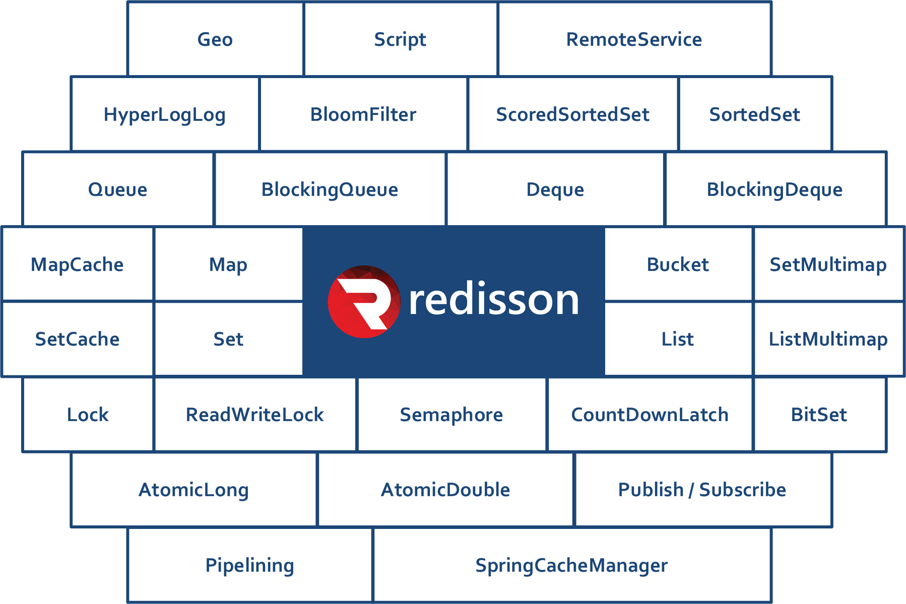
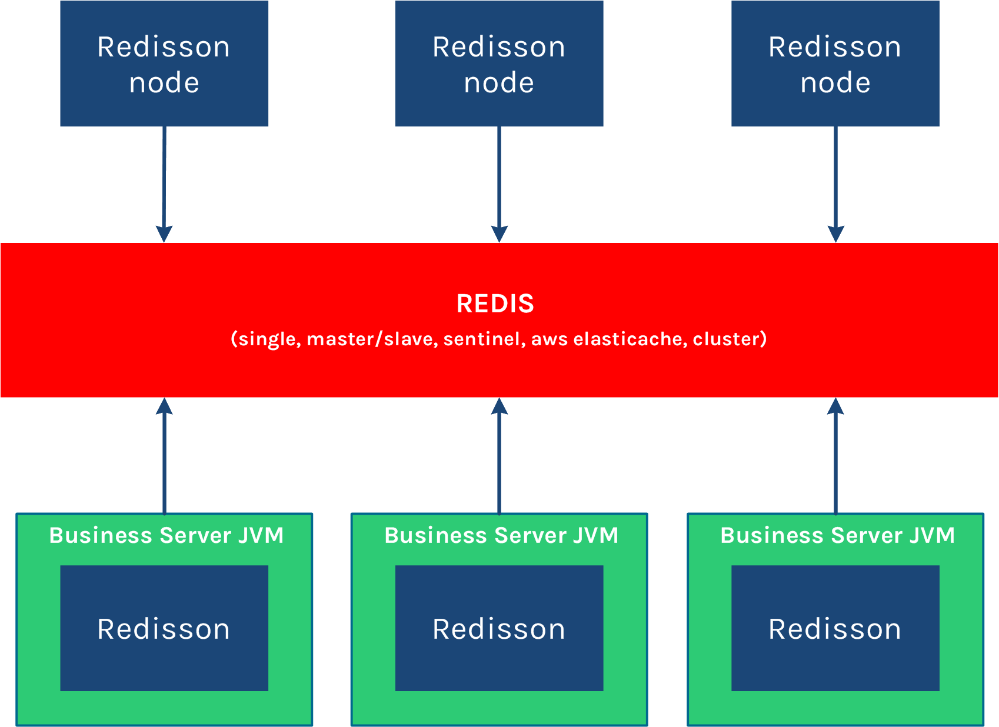
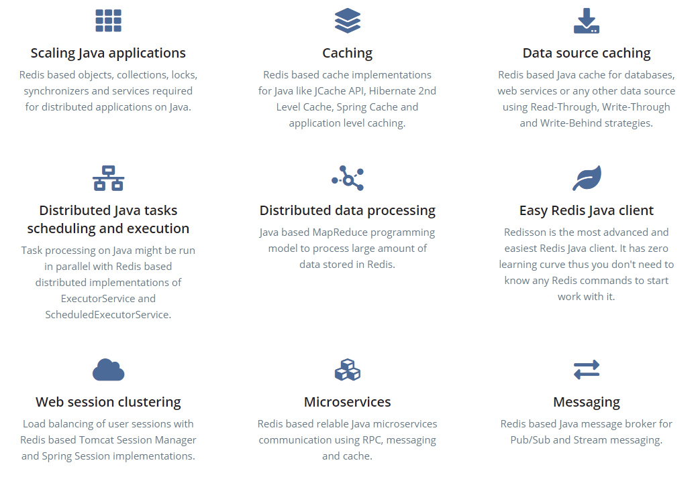

# 一、介绍

## 1.1 概述

&emsp;&emsp;**Redisson** 是一个在Redis的基础上实现的Java驻内存数据网格（In-Memory Data Grid）。充分的利用了Redis键值数据库提供的一系列优势，基于Java实用工具包中常用接口，为使用者提供了一系列具有分布式特性的常用工具类。使得原本作为协调单机多线程并发程序的工具包获得了协调分布式多机多线程并发系统的能力，大大降低了设计和研发大规模分布式系统的难度。同时结合各富特色的分布式服务，更进一步简化了分布式环境中程序相互之间的协作。


&emsp;&emsp;Redisson 采用了基于NIO的Netty框架，不仅能作为Redis底层驱动客户端，具备提供对Redis各种组态形式的连接功能，对Redis命令能以同步发送、异步形式发送、异步流形式发送或管道形式发送的功能，LUA脚本执行处理，以及处理返回结果的功能，还在此基础上融入了更高级的应用方案，不但将原生的Redis Hash，List，Set，String，Geo，HyperLogLog等数据结构封装为Java里大家最熟悉的映射（Map），列表（List），集（Set），通用对象桶（Object Bucket），地理空间对象桶（Geospatial Bucket），基数估计算法（HyperLogLog）等结构，在这基础上还提供了分布式的多值映射（Multimap），本地缓存映射（LocalCachedMap），有序集（SortedSet），计分排序集（ScoredSortedSet），字典排序集（LexSortedSet），列队（Queue），阻塞队列（Blocking Queue），有界阻塞列队（Bounded Blocking Queue），双端队列（Deque），阻塞双端列队（Blocking Deque），阻塞公平列队（Blocking Fair Queue），延迟列队（Delayed Queue），布隆过滤器（Bloom Filter），原子整长形（AtomicLong），原子双精度浮点数（AtomicDouble），BitSet等Redis原本没有的分布式数据结构。不仅如此，Redisson还实现了Redis文档中提到像分布式锁Lock这样的更高阶应用场景。事实上Redisson并没有不止步于此，在分布式锁的基础上还提供了联锁（MultiLock），读写锁（ReadWriteLock），公平锁（Fair Lock），红锁（RedLock），信号量（Semaphore），可过期性信号量（PermitExpirableSemaphore）和闭锁（CountDownLatch）这些实际当中对多线程高并发应用至关重要的基本部件。正是通过实现基于Redis的高阶应用方案，使Redisson成为构建分布式系统的重要工具。

&emsp;&emsp;Redisson 提供了使用Redis的最简单和最便捷的方法，不仅提供了一系列的分布式的Java常用对象，还提供了许多分布式服务。其中包括如下图所示：



&emsp;&emsp;Redisson 的宗旨是促进使用者对Redis的关注分离（Separation of Concern），从而让使用者能够将精力更集中地放在处理业务逻辑上。Redisson作为独立节点 可以用于独立执行其他节点发布到分布式执行服务 和 分布式调度任务服务 里的远程任务。以下是Redisson的结构：



&emsp;&emsp;Redisson 不只是一个 Java Redis 客户端，它是一个以内存 Redis 服务器作为后端的处理 Java 对象(如 java.util.List、java.util.Map、java.util.Set、java.util.concurrent.locks.Lock 等)的一个框架。它也提供了一些高级服务，如RemoteService和SpringCacheManager。Redisson 的目标是提供使用 Redis 的更方便和容易的方式。每个Redis服务实例都能管理多达1TB的内存。

## 1.2 功能



1. **扩展Java应用程序(Scaling Java applications )**
    - 基于Redis的对象、集合、锁、同步器和Java上分布式应用所需的服务。
2. **缓存(Caching)**
    - 基于Redis的Java缓存实现，如jcacheapi、Hibernate二级缓存、Spring缓存和应用程序级缓存。
3. **数据库缓存(Data source caching)**
    - 基于Redis的Java缓存，用于数据库、web服务或任何其他数据源，使用Read-Through、Write-Through和Write-Behind策略。
4. **分布式Java任务调度与执行(Distributed Java tasks scheduling and execution)**
    - Java上的任务处理可以与基于Redis的ExecutorService和ScheduledExecutorService的分布式实现并行运行。
5. **分布式数据处理(Distributed data processing)**
    - 基于Java的MapReduce编程模型，处理Redis中存储的大量数据。
6. **简易 Redis Java客户端(Easy Redis Java client)**
    - Redisson是最高级、最简单的RedisJava客户端。它的学习曲线为零，因此您不需要知道任何Redis命令就可以开始使用它。
7. **Session集群(Web session clustering Web)**
    - 使用基于Redis的Tomcat会话管理器和Spring会话实现的用户会话负载平衡。
8. **微服务(Microservices)**
    - 基于Redis的可重用Java微服务通信使用RPC、消息传递和缓存。
9. **消息传递(Messaging)**
    - 基于Java消息发布/代理的发布/消息传递。

## 1.3 重要说明

&emsp;&emsp;Redisson目前分开源版本和商业版(Redisson PRO),所以选择的时候请谨慎。（Map）和集（Set）数据分片功能仅限于Redisson PRO版本才有，另外Redis部署工具和集群管理工具功能仅限于Redisson PRO版本才有。关于商业版和开源版本的区别和商业版收费标准详见官网(https://redisson.pro/)   
&emsp;&emsp;`redisson`目前是【**Redis官方推荐**】，具体请查看 [wiki](https://github.com/redisson/redisson/wiki/%E7%9B%AE%E5%BD%95) ，关于Redisson项目的详细介绍可以在[官方网站](http://redisson.org/redisson_introduction_zh-cn.html)找到。

```xml
<!-- https://mvnrepository.com/artifact/org.redisson/redisson -->
<dependency>
	<groupId>org.redisson</groupId>
  	<artifactId>redisson</artifactId>
  	<version>x.y.z</version>
</dependency>
```

&emsp;&emsp;根据自己JDK环境，JDK 1.8+以上请选择3.5.4+版本，JDK 1.6+以上请选择2.10.4版。

```xml
<!-- JDK 1.8+ compatible -->
<dependency>
   <groupId>org.redisson</groupId>
   <artifactId>redisson</artifactId>
   <version>3.5.4+</version>
</dependency>  
 
<!-- JDK 1.6+ compatible -->
<dependency>
   <groupId>org.redisson</groupId>
   <artifactId>redisson</artifactId>
   <version>2.10.4</version>
</dependency>
```